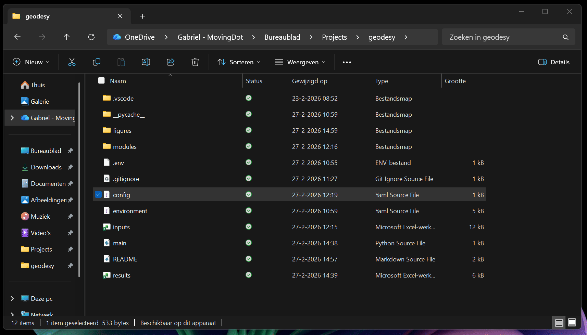
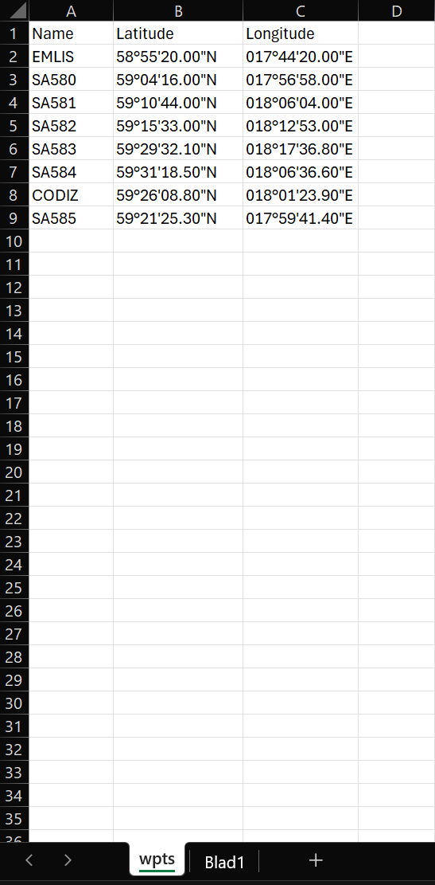

# Setup guide

You'll need to:

1. Download the [zip](https://github.com/GB-MD/bearingtool/archive/refs/heads/main.zip), unzip and put it in the desired working folder
2. Download **miniconda** [here](https://www.anaconda.com/download/success) (skip if you already have it installed)

Steps to get it to work (slightly different for mac, come talk to me if you have one):

- Open anaconda prompt
- Go to the project directory, copy its path (see GIF below)



- Type `cd` and copy paste the path into the terminal


- Copy and paste the command below into the terminal

```
conda env create -f environment.yml
```

# Running the code
To run the code you have to open anaconda prompt in the project directory (same as above: cd + project folder path) then paste the following instructions on the miniconda terminal:

```
conda activate bearingtool
```
```
python main.py
```

Your results will be generated in `results.xlsx`.

# Inputs
There are two interfaces for inputting parameters:
1. `config.yml`
2. The excel file containing the data

Edit the parameters in `config.yml` by opening it in notepad (or any text editor) and filling in the desired inputs for the input filename, model, date and the ARP parameters.


The inputs in excel are done in two sheets, one for the waypoints and the other for the routes. For the waypoints, you'll need the waypoints designator latitude and longitude (in dd or DMS) in the **first sheet**.



For the routes, you'll need the waypoint pairs describing the direction from which waypoint to which waypoint the aircraft is flying to in the **second sheet**.


